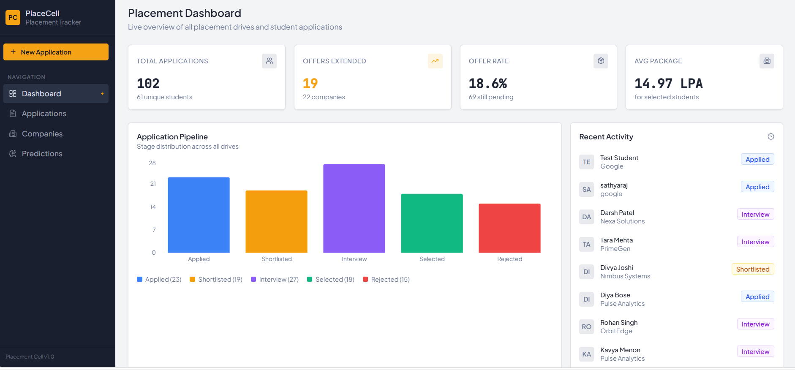
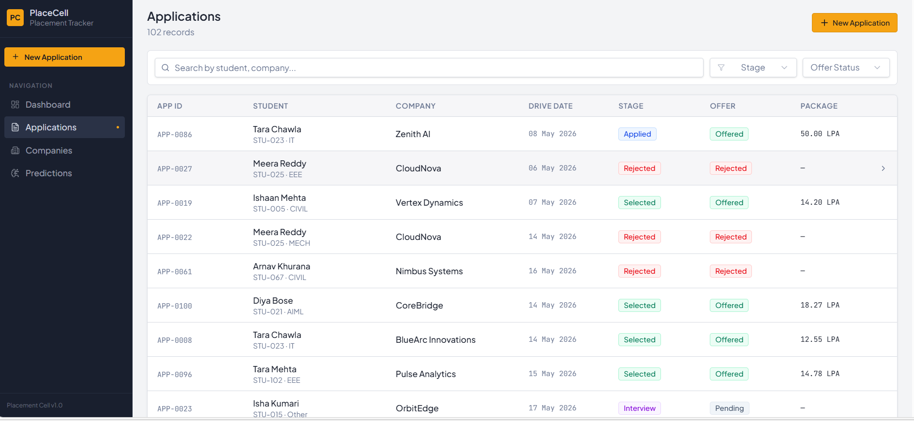
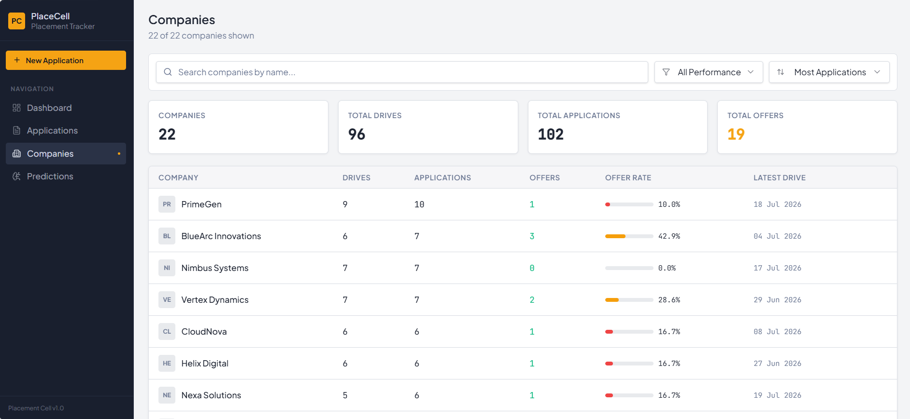
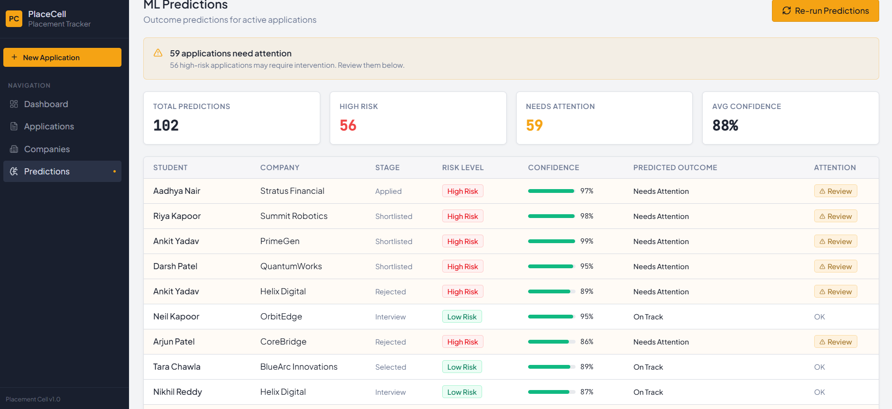

# College Placement Drive and Student Application Tracker 🎓📈

## 📌 Problem Description
A placement cell manages company notices and student applications manually on paper, leading to fragmented records across un-reconciled lists. This application provides an end-to-end digital tracker to record placement drives, monitor student stage outcomes, and predict high-risk applications using machine learning.

---

## 🛠️ Step-by-Step Task Implementation Status

| Task | Description | Status |
| :--- | :--- | :--- |
| **Task 1: Prepare Sample Data** | Realistic dataset (~100 records) with awkward cases, field definitions, and target labels. | ✅ Completed |
| **Task 2: Build Register End to End** | Form submission, server Zod validation, PostgreSQL persistence, and screen updates. | ✅ Completed |
| **Task 3: Build Prediction Model** | `RandomForestClassifier` trained on non-leaking pre-outcome features with fixed random seed. | ✅ Completed |
| **Task 4: Containerise Application** | Layered `Dockerfile`, `docker-compose.yml`, and `.env.example` with external configuration. | ✅ Completed |
| **Task 5: Integrate & Test** | Full flow tested, loading/empty/error states handled, low-confidence case fallback verified. | ✅ Completed |
| **Task 6: Document & Demonstrate** | Complete documentation, field definitions, derived figure logic, and setup guide. | ✅ Completed |

---

## 📋 Field Definitions & Allowed Values

| Field | Type | Description & Allowed Values | Awkward / Special Cases |
| :--- | :--- | :--- | :--- |
| `application_id` | String | Unique application code (e.g. `APP-0001`). | Auto-generated uppercase nanoid. |
| `student_id` | String | Student roll number (e.g. `STU-001`). | `STU_ORPHANED_001` (Student with no applications). |
| `student_name` | String | Full name of the student. | Very similar names (e.g. `Ananya Sharma` vs `Ananya Prasad`). |
| `company` | String | Recruiting company name (e.g. `Zenith AI`). | Case-insensitive multi-field search enabled. |
| `drive_date` | Date | Date of recruitment drive (`YYYY-MM-DD`). | Past and upcoming drive dates. |
| `stage` | Enum | `Applied`, `Shortlisted`, `Interview`, `Selected`, `Rejected`. | Stage progression tracks stall time. |
| `offer_status` | Enum | `Pending`, `Offered`, `Rejected`, `Withdrawn`. | `Withdrawn` flags urgent coordinator follow-up. |
| `package` | Decimal | Annual LPA (e.g. `12.50`). Null if not selected. | **Missing value (`null`)** for non-selected students. |
| `cgpa` | Decimal | Academic CGPA (`6.00` to `10.00`). | Used as ML input feature. |
| `branch` | String | Branch (`CSE`, `ECE`, `EEE`, `MECH`, `CIVIL`, `IT`, `AIDS`, `AIML`, `Other`). | Nullable/default fallback handled. |

---

## 🧮 How Derived Figures & Metrics Are Calculated

1. **Offer Rate (%)**:
   $$\text{Offer Rate} = \left( \frac{\text{Total Offers}}{\text{Total Applications}} \right) \times 100$$
   Calculated dynamically per company on the server and frontend.

2. **Days Since Drive**:
   $$\text{Days Since Drive} = \text{Current Date} - \text{Drive Date (in days)}$$

3. **Ground-Truth Outcome (`needs_attention`)**:
   - `Applied` stage for **> 7 days** ➔ `True` (Stalled)
   - `Shortlisted` stage for **> 14 days** ➔ `True` (Stalled)
   - `Rejected` stage or `Withdrawn` status ➔ `True` (Requires counseling/redirection)

4. **ML Model & Confidence Threshold**:
   - Model: `RandomForestClassifier(n_estimators=50, max_depth=5, random_state=42)`
   - Features used (pre-outcome only): `stage_encoded`, `days_since_drive`, `cgpa`, `branch_encoded`, `company_drive_count`. *(No outcome leakage from package or offer status)*.
   - **Low Confidence Threshold**: $\text{Confidence} = \max(P_{\text{On Track}}, P_{\text{Needs Attention}})$. If $\text{Confidence} < 0.60$, **no forced prediction** is assigned (`predicted_outcome = null`).

---

## 🚀 How to Run the Project Step-by-Step

### Prerequisites
- Node.js `v20+` or `v22+`
- `pnpm` (`npm install -g pnpm`)
- Python `3.11+`
- PostgreSQL `16+` (Running locally on `localhost:5432`)

---

### Step 1: Clone & Install Dependencies
```bash
pnpm install
```

### Step 2: Configure Environment
Copy `.env.example` to `.env`:
```bash
cp .env.example .env
```
Ensure PostgreSQL has a database named `placement_tracker`:
```env
DATABASE_URL=postgres://<username>:<password>@localhost:5432/placement_tracker
```

### Step 3: Seed Sample Dataset (100 Records)
```bash
pnpm --filter @workspace/db run seed
```

### Step 4: Run Machine Learning Predictions
```bash
python ml-service/predict.py
```

### Step 5: Build Project Workspace
```bash
pnpm run build
```

### Step 6: Start Services

#### Backend API Server (Port 3000):
```bash
pnpm --filter @workspace/api-server start
```

#### Frontend Web Application (Port 5173):
```bash
pnpm --filter @workspace/placement-tracker dev
```

Open [http://localhost:5173](http://localhost:5173) in your browser.

---

## 🐳 Docker Deployment

To run the entire stack using Docker:
```bash
docker-compose up --build
```

---

## 🛑 What is Not Finished / Future Enhancements

- **Cloud Deployment Pipeline**: Dockerfile and docker-compose configs are ready for container runtime; automated GitHub Actions CI/CD to AWS/GCP cloud can be added in production.

---

## 📸 Application Screenshots

### 1. Placement Dashboard

*Overview of placement statistics, drive metrics, selection rates, and top hiring companies.*

---

### 2. Applications Management & Search

*Multi-field search (Student Name, Company, Roll Number, Branch) and stage/offer status filters.*

---

### 3. Companies Analytics & Performance

*Company drives summary, offer rate percentage indicators, performance filter, and sorting.*

---

### 4. ML Placement Risk Predictions

*RandomForestClassifier prediction output identifying high-risk applications requiring coordinator follow-up.*
